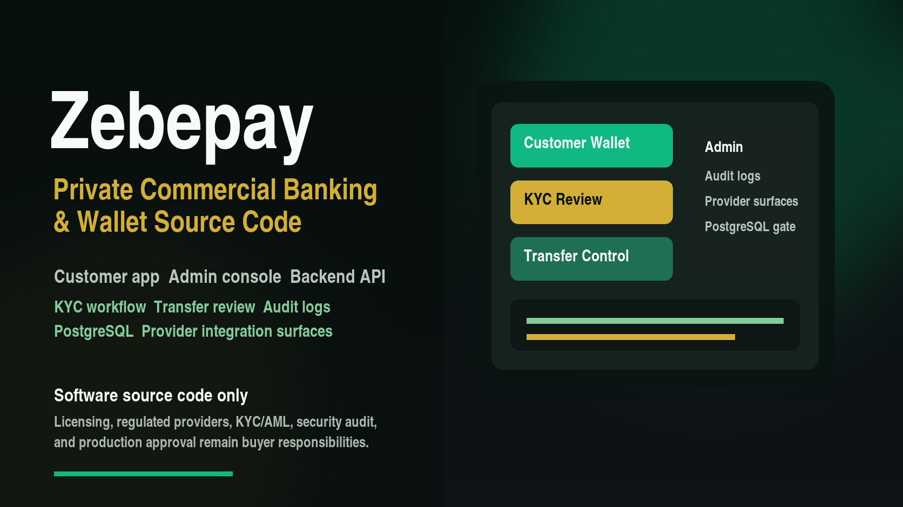

# Zebepay Preview

Zebepay is a private commercial Nigerian payment-gateway, wallet, and banking
infrastructure source-code foundation for fintech founders, agencies,
developers, cooperatives, and licensed operators.



## What This Preview Is

This public repository is a buyer preview only. It is designed to help buyers
understand the product, review buyer-safe screenshots, confirm the commercial
boundary, and request a controlled private deal.

The full source-code repository is private. Full source access is delivered only
after buyer approval, payment confirmation, license acceptance, refund-policy
acceptance, support-scope acceptance, confirmed buyer GitHub username or
organization, and a recorded delivery event.

## What Buyers Receive In The Full Private Package

- Customer banking app.
- Admin operations dashboard.
- Backend API service.
- Shared banking domain package.
- PostgreSQL-compatible data model and production-readiness gate.
- NGN/kobo money handling.
- Nigerian bank-code support.
- BVN/NIN-ready KYC workflow.
- Wallet/account workflow.
- Ledger, transfer, reversal, risk-review, OTP, trusted-device, notification,
  and audit boundaries.
- Setup, API, deployment, troubleshooting, handoff, release, sales, and
  fulfillment documentation.
- Commercial buyer ZIP and SHA256 checksum after approved delivery.

## Buyer Preview Contents

```text
assets/marketplace/          Product image
artifacts/screenshots/       Customer and admin preview screenshots
docs/PRODUCT_OVERVIEW.md     Product scope and buyer value
docs/CODE_PREVIEW.md         Architecture and code-review boundary
docs/GITHUB_BUYER_ACCESS_MODEL.md
sales/DEAL_REQUEST.md        How to request access or a custom deal
release/PREVIEW_PACKAGE.md   Public-preview package manifest
LICENSE.md                   Proprietary preview license notice
```

## Pricing Summary

- Builder License: EUR 5,000.
- Commercial Launch License: EUR 10,000.
- Enterprise / Investor-Grade Package: EUR 20,000.

Final pricing, license, refund policy, support scope, buyer access, and delivery
timing are subject to seller approval.

## Compliance Notice

Zebepay is source-code software only. It is not a licensed bank, regulated
payment processor, legal opinion, compliance certification, production security
certification, direct payment-rail access, or managed production service.

Buyers are responsible for licensing, regulated provider contracts, KYC/AML
provider setup, legal review, compliance review, production security audit,
hosting, support operations, monitoring, and go-live approval.

## Request Access Or A Deal

Open a structured GitHub deal request:

https://github.com/ejikezebedee/zebepay-preview/issues/new?template=deal-request.yml

Review `sales/DEAL_REQUEST.md` first, then submit:

- Buyer category.
- General use case.
- Package interest.
- Request for private contact.

For serious commercial discussions, use the approved private email/form after
the initial request.

## Full Access Rule

This preview repository is for buyer confidence only. Full source-code access is
delivered through the private `zebepay` repository only after all access
conditions are satisfied.

Do not post passwords, private keys, API tokens, bank/provider details, budget,
confidential company strategy, BVN/NIN values, customer data, private
documents, or internal infrastructure details in a public GitHub issue.
